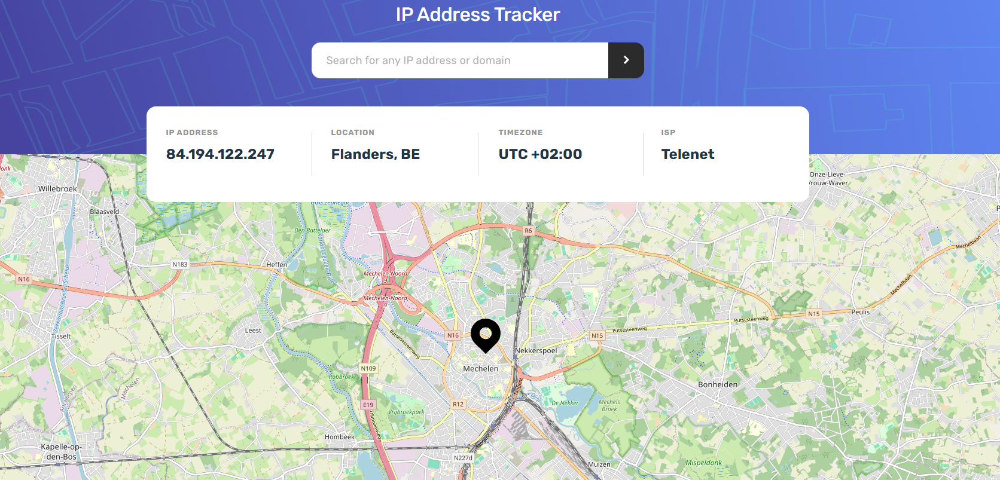

# Frontend Mentor - IP address tracker solution

This is a solution to the [IP address tracker challenge on Frontend Mentor](https://www.frontendmentor.io/challenges/ip-address-tracker-I8-0yYAH0). Frontend Mentor challenges help you improve your coding skills by building realistic projects. 

## Table of contents

- [Overview](#overview)
  - [The challenge](#the-challenge)
  - [Screenshot](#screenshot)
  - [Links](#links)
- [My process](#my-process)
  - [Built with](#built-with)
  - [What I learned](#what-i-learned)
  - [Continued development](#continued-development)
  - [Useful resources](#useful-resources)
- [Author](#author)
- [Acknowledgments](#acknowledgments)

## Overview

### The challenge

Users should be able to:

- View the optimal layout for each page depending on their device's screen size
- See hover states for all interactive elements on the page
- See their own IP address on the map on the initial page load
- Search for any IP addresses or domains and see the key information and location

### Screenshot



### Links

- Solution URL: [https://github.com/Simplify4Me2/ip-address-tracker/](https://github.com/Simplify4Me2/ip-address-tracker)
- Live Site URL: [https://simplify4me2.github.io/ip-address-tracker/](https://simplify4me2.github.io/ip-address-tracker/)

## My process

### Built with

- Semantic HTML5 markup
- CSS custom properties
- Flexbox
- CSS Grid
- Mobile-first workflow
- [React](https://reactjs.org/) - JS library
- [Vite](https://vite.dev/) - The build tool for the web

### What I learned

Being used to fetching data with a custom _useFetch_ hook, it was innovative to be able to use the recommended _useQuery_.

```js
const { data, isLoading, error } = useQuery({
    queryFn: () => fetchData(ipAddress),
    queryKey: ["country", ipAddress],
  });
```
It was really fun and actually rather easy to use the Leaflet js library
```html
    <MapContainer
      {...mapContainerProps}
      center={[51.0337, 4.4795]}
      className="map"
    >
      <TileLayer {...titleLayerProps} />
      <UpdateMapCenter latitude={latitude} longitude={longitude} />
      <Marker position={coordinates} icon={customIcon}>
        <Popup>
          A pretty CSS3 popup. <br /> Easily customizable.
        </Popup>
      </Marker>
    </MapContainer>
```

### Continued development

In the future I will be focusing on using the recommended useQuery hook for fetching data. Manually memoizing and caching data seems a thing of the past 

### Useful resources

- [Medium - useQuery](https://medium.com/@bhairabpatra.iitd/usequery-hook-in-react-b06ef604ea46) - This helped me to quickly start using the useQuery hook for the basic fetch I needed.

## Author

- Website - [Simon Vereecke](https://simplify4me2.github.io/)
- Frontend Mentor - [@Simplify4Me2](https://www.frontendmentor.io/profile/Simplify4Me2)
- Twitter / X - [@simon_vereecke](https://x.com/simon_vereecke)
- GitHub - [@Simplify4Me2](https://github.com/Simplify4Me2)

## Acknowledgments

Thanks to the Leaflet JS library. My support goes to all the innocent victims in the war between Russia and Ukraine. May it end soon 🙏
